# Perfect Personnel Placement Frontend


[](https://sonarcloud.io/dashboard?id=Perfect-Personnel-Placement_frontend)
[](https://sonarcloud.io/dashboard?id=Perfect-Personnel-Placement_frontend)
[](https://sonarcloud.io/dashboard?id=Perfect-Personnel-Placement_frontend)

[](https://sonarcloud.io/dashboard?id=Perfect-Personnel-Placement_frontend)
[](https://sonarcloud.io/dashboard?id=Perfect-Personnel-Placement_frontend)

NOTE: This is the frontend of the repository. To access the backend repository, refer to
[Perfect-Personnel-Placement/backend](https://github.com/Perfect-Personnel-Placement/backend).

*The project is only built for Android. While we also worked on the P3 with iOS in mind, certain components get off-centered in iOS and all the bugs have not been fleshed out.*

*The APK and the QR Code only work for Android Devices.*

## Project Description

The Serverless Training planner is a serverless mobile app that Revature managers can use to look at important information regarding clientele demands and batch output for the company. This service visualizes all current batches planned along with any associated information. It also visualizes that batch output alongside the client demand for associates. Managers may input information for clients, their demands, and batches which consist of a curriculum composed of skills, the number of associates, a trainer, and the dates for the batch. This service helps ease the management of supply and demand for the company and is an organizational aid.

## Frontend Stack
- React Native
- TypeScript
- Jest/Enzyme
- Expo

## Features

### Bottom Navigation
- Batch Screen (first screen):
  - Add a batch
  - View all batches and overall graph of types of batches and trainers
  - Edit Batch information
  - Delete a Batch
- Client Screen:
  - View clients and their demands
  - Add a client
  - Add a demand to a client
  - Edit clients' demands
- Curricula Screen:
  - View curricula and expand it to see more information
  - Create a curriculum by adding associated skills
- Trainer Screen:
  - View all trainers
  - Search for a trainer through the searchbar
  - View/Update a specific trainer's information
  - Add a trainer

### Drawer Navigation
- Home
- Supply/Demand
  - Graph of both the client demand and the associate supply 
- Skills
  - Add, View, and Delete Skills 
- Sign Out (purely for show meant to remind future developers to add Cognito)

### Toast and Alert Messages
Upon a delete action, the user will prompted to confirm if they want to delete the item for **form validation** which is evident accross the application. However, the curricula components would need to be refactored to get form validation on the curricula screen.
Upon an add or update/edit action, a notification will appear coming from the bottom of the device that the user's action has been successfully processed.

## Getting Started
Quick and Easy Use:
https://expo.dev/@mat2718/frontend
In order to run P<sup>3</sup>, please install the Expo Go app on your android mobile device. Then, using the Expo Go app, scan the QR code below:

<p align="center">
 
</p>

Other Methods:

- If the above method is not suitable for you, you have two options to download the APK from. Both use the provided link: https://exp-shell-app-assets.s3.us-west-1.amazonaws.com/android/%40mat2718/frontend-674a843668ab4c3095527ad19b570f41-signed.apk
  - Using your mobile device (_preferable choice would be to use Expo or download using the emulator_):
    1. Enable sideloading
    2. Allow Permissions for Unknown Apps. The location depends on the version of the device. Refer here: https://www.verizon.com/support/knowledge-base-222186/
    3. [Download the app](https://exp-shell-app-assets.s3.us-west-1.amazonaws.com/android/%40mat2718/frontend-674a843668ab4c3095527ad19b570f41-signed.apk)
    4. Install any dependencies that pop up. You will be prompted.
  - Using an Emulator:
    1. [Download the app](https://exp-shell-app-assets.s3.us-west-1.amazonaws.com/android/%40mat2718/frontend-674a843668ab4c3095527ad19b570f41-signed.apk)
    2. Download and Install [Android Studio](https://developer.android.com/studio)
    3. Create a blank project and open the AVD (Android Virtual Device) located in the top right of your screen.
    4. Create a device if one is not already present and choose one of the newer models. We recommend the Pixel 4a.
    5. Press the play icon (expect a long start up time) and drag and drop the APK on the emulator screen. Now it will begin installing and you are good to go.

**There is no login screen so expect the batches screen upon startup.**

### For Development:

To clone the repository, run the following command in your terminal:

```powershell
https://github.com/Perfect-Personnel-Placement/frontend.git
```

Alternatively, if you have Github Desktop, you can click on **Code** and **Open with Github Desktop**.
Be sure [NodeJS](https://nodejs.org/en/download/) is installed as well as a text editor. We used [Visual Studio Code](https://code.visualstudio.com/download).

To check if NodeJS and Node Package Manager installed correctly, run the following command:

```powershell
node --version
npm --version
```

Both should result in a version display.
Once installed, open up the root of the repository and install P<sup>3</sup>'s dependencies:

```powershell
npm install
```
This will read from the package.json and install listed dependencies, including React and TypeScript.

Following the dependency installation, we recommend installing the expo-cli globally:
```powershell
npm install -g expo-cli
```
At this point, everything should be ready to run the application. Run in the root directory:

```powershell
npm start
```

Then, a new tab will appear in your browser giving you several methods of running the application. You may use iOS during development; however, we do not have a developer's license for iOS which is why the current iteration of P<sup>3</sup> can only be run on an android device.

For more information on key components, visit the COMPONENT.md in the root.

## Usage

The following main screens can be navigated to through the bottom navigation.

### Batches Screen

<p align="center">
 
 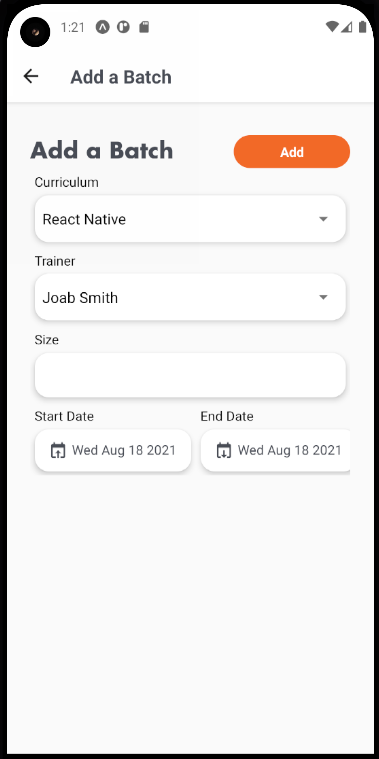
 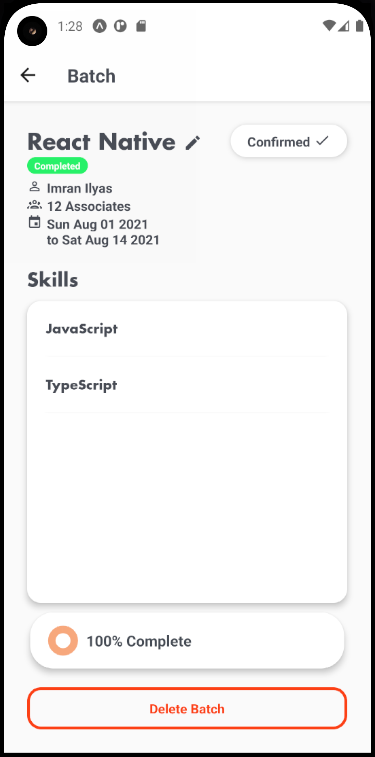
 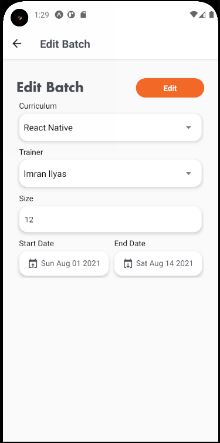
</p>


Upon starting the application, the first page the user sees is the Batches Main Screen. The bar graph that appears represents the number of active trainers and batches as well as planned and inactive batches and trainers respectively. Below displays all batches; however, the user can click on the downward carot icon to display a dropdown of different filters (All Batches, Active Batches, Upcoming Batches, Completed Batches).

The add screen which is the second screen above can be navigated to by clicking on the Add Batch button in the top right of the screen. The user may fill out the required inputs and click Add to confirm the batch. If the user does not not fill in a size or if the start date is greater than or equal to the start fate, a message from the bottom of the screen will come up notifying the user that the input fields are invalid.

To view a Batch, click on one of the batches and you will the third screen as shown above. Here, the user will see the name of the batch and its information associated with it, the number of skills assigned, and the status of the batch. The user may also delete a batch where they will prompted with an alert or choose to edit a batch by clicking on the pencil icon in the top left of the screen adjacent to the name of the batch.

The fourth screen displays the Edit Batch screen, where the user may edit the curriculum name, the trainer assigned to the batch, the batch size, and the start/end date. To navigate back from the subscreens, click on the back arrow on the header on the top left of the screen.

### Clients Screen

<p align="center">
 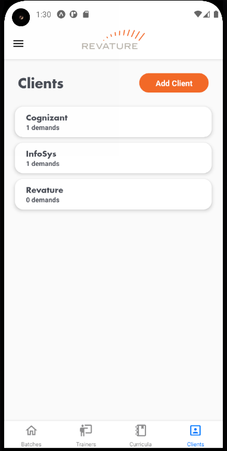
 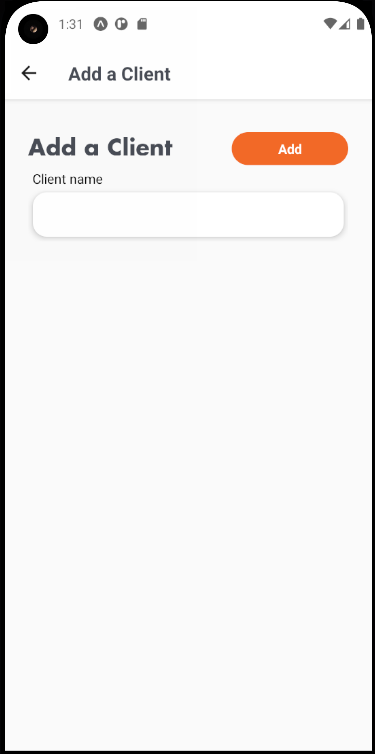
 
 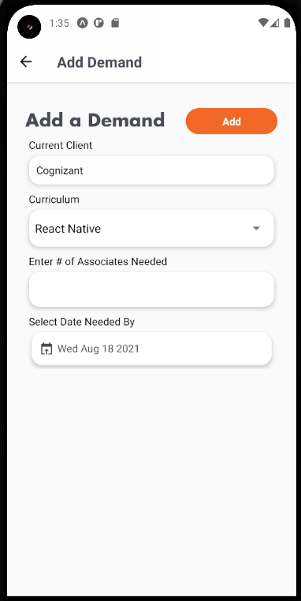
</p>

The Main Client Screen as seen in the first photo above is a list of all the clients. Each client is clickable and you may navigate to a specific client or add a client. The add client screen as shown in the second photo above is just a text field where you may add a client and hit add to send it to the database. The third photo is if you navigate by clicking on a specific client. Finally, the user may add a demand by clicking on the Add Demand button and it will navigate to the fourth screen. 

### Curricula Screen

<p align="center">
 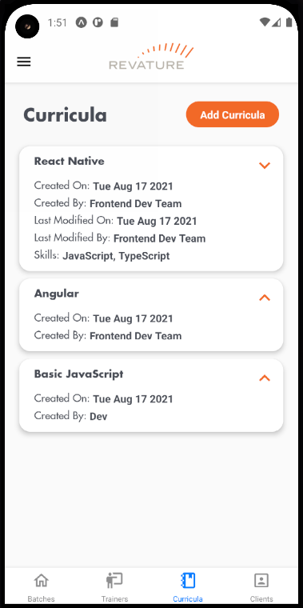
 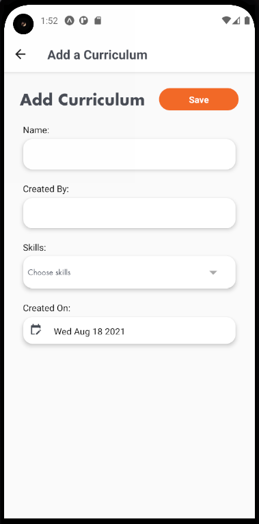
</p>

The Main Curricula Screen displays all created curricula. Each curriculum is expandable, meaning if you click on the curriculum more information will be displayed as shown from the first photo above. If you click on Add Curriculum, it will navigate to the second photo as seen above where the user may add a curriculum. 

**Form validation has not been implemented on this screen.**

### Trainer Screen

<p align="center">
 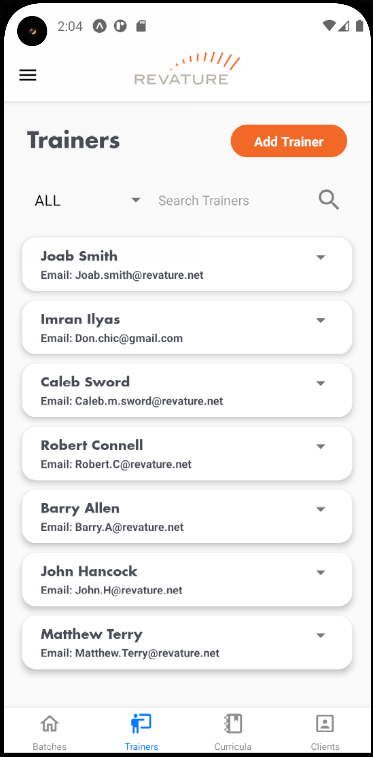
 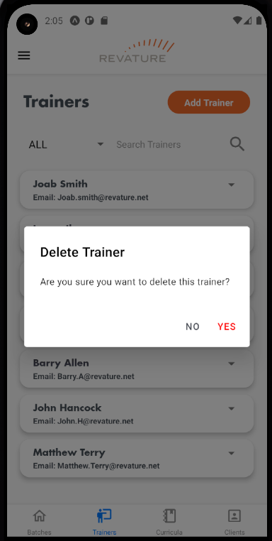
 
 
</p>

The Main Trainer screen (as shown in the first photo above) displays all trainers in the database. Each trainer has a picker on the right side of its container where the user may choose to edit or delete the trainer. If the user chooses to delete the trainer, they will be prompted with an alert to confirm if they want to delete the trainer as shown in the second photo above. The user may also choose to search for a trainer using the search bar.

If the user chooses to edit the trainer, they will navigate to the third screen above where they can edit the first name, last name, and email of the trainer. The fourth screen is what happens if you click on Add Trainer which contains the same contents as the Edit Trainer Screen. Upon submitting a trainer, the fields will be cleaned up and you may add another trainer or return to the main trainer screen.

Note: *A user can only delete a trainer that has not been added to a batch. To remove that trainer, the batch the trainer is mapped to needs to be deleted before deleting the trainer.* 

### Drawer

<p align="center">
 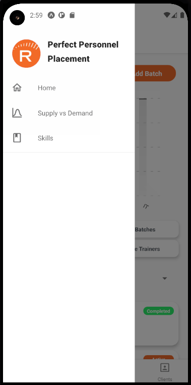
</p>

To access the drawer, either slide from the left side of the screen or click on the hamburger icon on the top left side of the screen. The following screens can only be navigated to through the drawer. 

### Supply vs Demand Screen

<p align="center">
 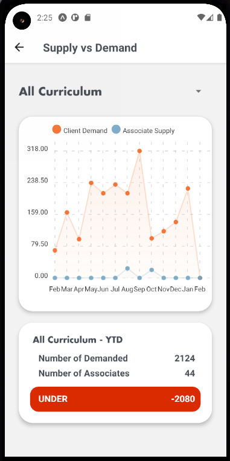
</p>

If the user clicks on supply vs Demand in the Drawer, the application navigates the user to the above screen. Here is a graphical representation of the Clients demands vs the number of Associates in training. The default is All Curricula but if the user clicks on the picker, it will display all the curriculum the user may choose to filter the chart with. 

### Skills Screen

<p align="center">
 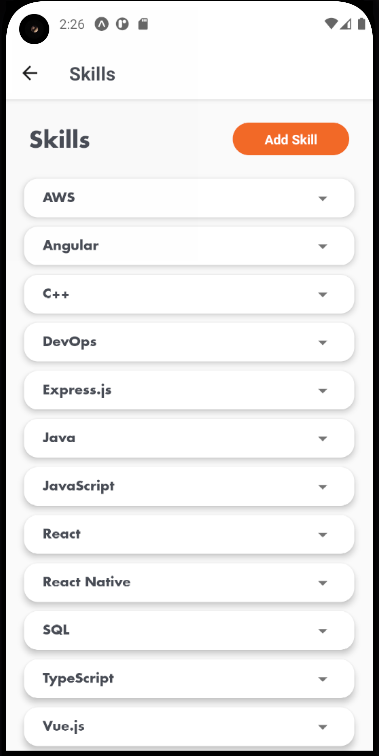
 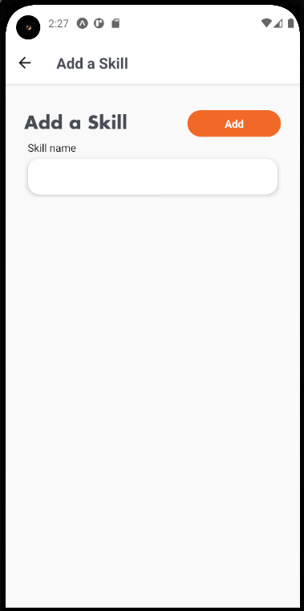
</p>

Skills is the other choice the user may navigate to from the drawer. The first photo is the Main Skills Screen where each skill can be deleted by clicking on the picker on the right side of the container. The user may also choose to add a skill by clicking on the Add Skill button, where they will navigate to the second screen above.

## Future Implementations
- Form Validation in Curricula
- Search Bar functionality needs to be fixed (was lost in merge conflicts)
  - The search works but the filtering is what likely causes it to display all trainers after searching with a filter.  
- Delete Trainer needs a notification if it can't be deleted due to the trainer being assigned to a batch
- Cognito implementation
- Login Screen and Logout button

## Contributors

- [Joab Smith](https://github.com/j-m-smith426)
- [Red Oral](https://github.com/redoral)
- [Matthew Otto](https://github.com/MattlttaM)
- [Matthew Hanrahan](https://github.com/Thomas-Marik)
- [Caleb Sword](https://github.com/calebmsword)
- [Hannah Mulato](https://github.com/hpeninah)
- [Kent Smith](https://github.com/kentsmith1996)
- [Kaiyip Ho](https://github.com/Kaichloe)
- [Imran Ilyas](https://github.com/imranilyas)

## License

[](https://github.com/Perfect-Personnel-Placement/frontend/blob/24ef3a7f2e226f47707beaf91a3efbc4b2a4a644/LICENSE)
